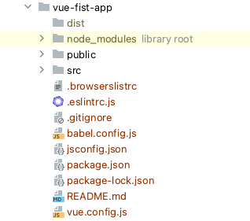
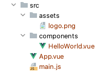

# Vue-cli
Vue-cli é uno strumento creato per aiutarti a creare e gestire SPA (single page applications) usando Vue. 


## Comandi base

### Istallazione
```shell
brew brew install vue-cli
```

### Create
```shell
vue create vue-fist-app
```
Crea una prima applicazione

### Serve
Una volta dentro la cartella dell'applicazione per lanciare un server locale puoi
```shell
npm run serve
# or 
vue serve
```

### Contenuto directory di un progetto base

- `dist`: questa directory (non presente fino a quando non eseguirai il comando `npm run build`) conterrà l'applicazione
compilata.
- `node modules`: normalmente questa dir va aggiunta al file `.gitignore` perché contiene tutti i paccetti node js 
che il progetto richiede per funzionare. Non viene salvata in git perché il suo contenuto é riassunto nei files
`package.js` e `package.lock.js` 
- `public`: questa dir contiene un file `index.html` di base, il file `favicon.ico` di default e conterrà, quando il 
progetto verrà compilato i files generati da `vue` e che conterranno l'applicazione vera e propria.
- `src`: questa é la directory che conterrà tutti i sorgenti
- `package.json`: é il `composer.json` delle applicazioni `nodeJs`. Contiene l'elenco dei pacchetti necessari e delle 
rispettive versioni minime richieste necessare allo sviluppo e alla compilazione della applicazione.
- `package-lock.json`: é il `composer.lock` delle applicazioni `nodeJs`. Contiene un elenco di tutti pacchetti (quelli
contenuti nel `package.json` e tutte le dipendenze) e delle relative versioni per rendere lo stesso environment riproducibile.
- `README.md`: un file md per descrivere l'applicazione.

### SRC

- `assets`: contiene tutto quello che non é un componente Vue, come le immagini ad esempio.
- `components`: qui puoi mettere tutti i componenti Vue.
- `App.vue`: il componente Vue principale collegato al file index che trovi in `public`
- `main.js`: contiene il codice JS necessario per importare e inizializzare il componente principale e avviare l'app di 
base


